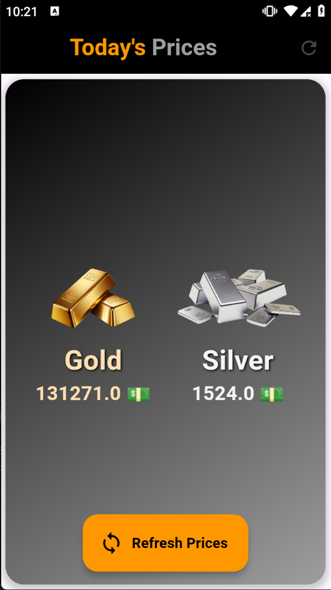

# GoldSilverTracker

***GoldSilverTracker*** is a Flutter application that allows users to view real-time prices of gold and silver. The app fetches the latest prices from a reliable API and presents them in a user-friendly interface.

## Features

- **Real-Time Price Updates**: Get the latest prices of gold and silver with a simple refresh.
- **Beautiful UI**: Stylish design with a gradient background and smooth animations.
- **Responsive Layout**: Adapts to different screen sizes for an optimal user experience.

---

## ⭐️ If you find this project useful, please give it a star! ⭐️  
Your support helps me to keep improving and maintaining this project. Thank you!

---

## Screenshot

Here is a screenshot showcasing the **GoldSilverTracker** app:



---

## Technologies Used

- **Flutter**: A UI toolkit for building natively compiled applications.
- **Dio**: A powerful HTTP client for Dart, used for making API requests.
- **Bloc**: A state management library to manage the application's state.

---

## Installation

To get started with **GoldSilverTracker**, follow these steps:

1. **Clone the repository**:

   ```bash
   git clone https://github.com/Islam-Ragab015/GoldSilverTracker.git
